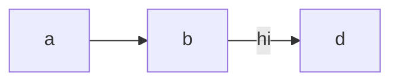

# mkdocs-template
- [mkdocs-template](#mkdocs-template)
  - [Steps taken to set up MkDocs](#steps-taken-to-set-up-mkdocs)
  - [This is a demo for mermaid diagram](#this-is-a-demo-for-mermaid-diagram)

<!--intro-start-->

This repo is created to demonstrate how I write documentation with MkDocs.

## Steps taken to set up MkDocs
- pip install mkdocs
- Mkdocs new . (to create docs folder for MkDocs)
- pip install mkdocstrings  
- pip install 'mkdocstrings[python]' ??? not sure
- pip install mkdocs-include-markdown-plugin

## This is a demo for mermaid diagram

<!--intro-end-->