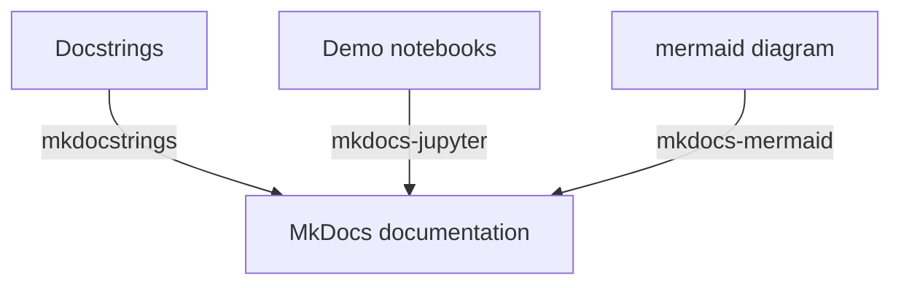

# MkDocs-template

## Introduction
This repository is created to demonstrate how I put together documentation for data science projects by utilising MkDocs with several essential extensions. Obviously, comprehensive documentation would cover enough amount of information for different needs. For instance, a system diagram would allow audiences to fairly quickly grasp the overview of the system. Also an API doc would be ideal for those who really want to figure out how to exactly use or configure APIs. Moreover, providing demos in data scientist's favorite 'IDE' jupyter notebook is very beneficial and would be greatly appreciated. In order to incorporate each of those elements in MkDocs, it requires specific packages so that things can be rendered and viewed nicely. In the following section, I will explain how what dependencies are required and how to use them properly.

## Components

### Mkdocstrings
To let MkDocs pick up the docstring you write, you will need MkDocstrings.

### Mkdocs-jupyter
It is essential to include some demo examples in the documentation, so others can read them without having to spin up a local jupyter session or configure an environment.
### Mkdocs-mermaid
Sometimes, it is extremely hard to describe something clearly without visuals. It is even more difficult to keep the system diagram also update to date since the codebase might constantly keep changing. Mermaid diagram is a markdown-based diagram generation tool that allows you to generate various kinds of diagrams using markdown language.

## Setup
- pip install -r requirements.txt

### Deploy the doc
