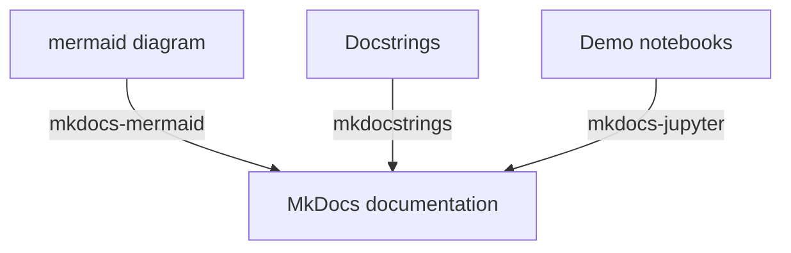

# MkDocs template for data science projects

## Introduction
This repository is created to demonstrate how I put together documentation for data science projects by utilising MkDocs with several essential extensions. Comprehensive documentation would cover the information for different needs. For instance, a system diagram would allow audiences to fairly quickly grasp the overview of the system. Also an API doc would be ideal for those who really want to figure out how to exactly use or configure APIs. Moreover, providing demos in data scientist's favorite 'IDE' jupyter notebook is very beneficial and would be greatly appreciated. In order to incorporate each of those elements in MkDocs, it requires very specific packages so that all the elements can be rendered and viewed nicely. In the following section, I will explain how what dependencies are needed and how to configure them properly.

## Components
Three packages are required including mkdocs-mermaid, mkdocstrings and mkdocs-jupyter. It is quite obvious to tell what job each package does from their names. Mkdocstrings picks up all the docstrings written and format them professionally. Mkdocs-jupyter renders jupyter notebook but it might have difficulties with certain types of outputs, such as interactive plots created by Plotly. Sometimes, it is pretty hard to describe something clearly without visuals. It is even more difficult to keep the system diagram always update to date since the codebase might constantly keep changing. Mkdocs-mermaid enables rendering mermaid diagrams. (Mermaid diagram is a markdown-based diagram generation tool that allows you to generate various kinds of diagrams using markdown language.)

## Setup
- pip install -r requirements.txt
- Initialise mkdocs
- Create regular pages
  - just write like a normal markdown file
- Create API pages
  - just reference to the module
- Organise the structure in the nav section in mkdocs.yml file

### Deploy the doc
