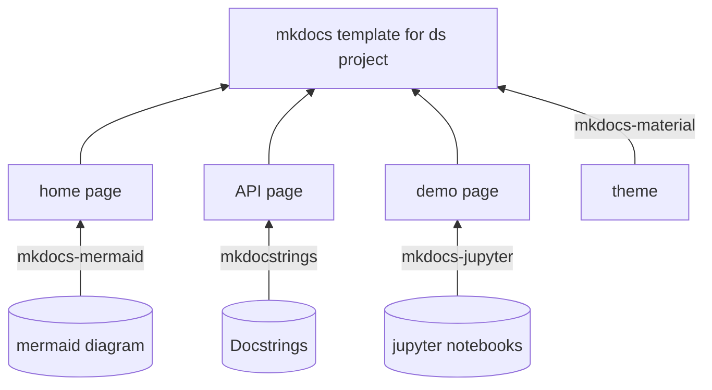

# MkDocs template for data science projects

## Introduction
This repository is created to demonstrate how I put together documentation for data science projects by utilising MkDocs with several essential extensions. Comprehensive documentation should cover the information for different aspects. The proposed template has three pages including the home page, API page and demo page.

The home page serves as a starting point for the project by covering some of the key information, such as the introduction, system diagram and usage guide. It aims to help the audience quickly grasp the overview of the system. The next page is the API page which presents docstrings. It is ideal for those who want to figure out how to exactly use or configure APIs. The last page is the demo page which displays Jupyter notebook demos and it is very beneficial and would be greatly appreciated. To seamlessly integrate these three pages in MkDocs, requires some very specific packages so that all pages can be rendered and presented nicely. In the following section, I will explain what dependencies are needed and how to configure them properly.

## Components
Three packages are required including mkdocs-mermaid, mkdocstrings and mkdocs-jupyter. It is quite obvious to tell what job each package does from their names. Mkdocstrings picks up all the docstrings written and format them professionally. Mkdocs-jupyter renders jupyter notebook but it might have difficulties with certain types of outputs, such as interactive plots created by Plotly. Sometimes, it is pretty hard to describe something clearly without visuals. It is even more difficult to keep the system diagram always update to date since the codebase might constantly keep evolving. Mkdocs-mermaid enables rendering mermaid diagrams. (Mermaid diagram is a markdown-based diagram generation tool that allows you to generate various kinds of diagrams using markdown language.)

## Usage
### Setup
- pip install -r requirements.txt
- Initialise mkdocs
- Home page
  - Create a markdown file in docs and reference it in the nav section in the mkdocs.yml file. See line 35 in the mkdocs.yml file.
  - Write on the markdown file like how you usually would do it in a readme file.
- API page
  - Make sure the scripts have docstrings.
  - Create a markdown file in docs and reference it in the nav section in the mkdocs.yml file. See lines 36-39 in the mkdocs.yml file.- Demo page
  - Each markdown file can associate with at least one module. To include a module, it follows a convention that is very similar to relative importing. For example, the first line in 'car.md' (:::src.car) means including go up two levels and include all docstrings in the car.py module.
- Demo page
  - Create a folder named notebooks inside the docs folder. Place the demo notebook in the notebooks folder. Referernce it in the nav section in the mkdocs.yml file. See lines 40-41.
  

### Deploy the doc
To deploy the documentation in github, you can follow the instructions below.

https://squidfunk.github.io/mkdocs-material/publishing-your-site/
