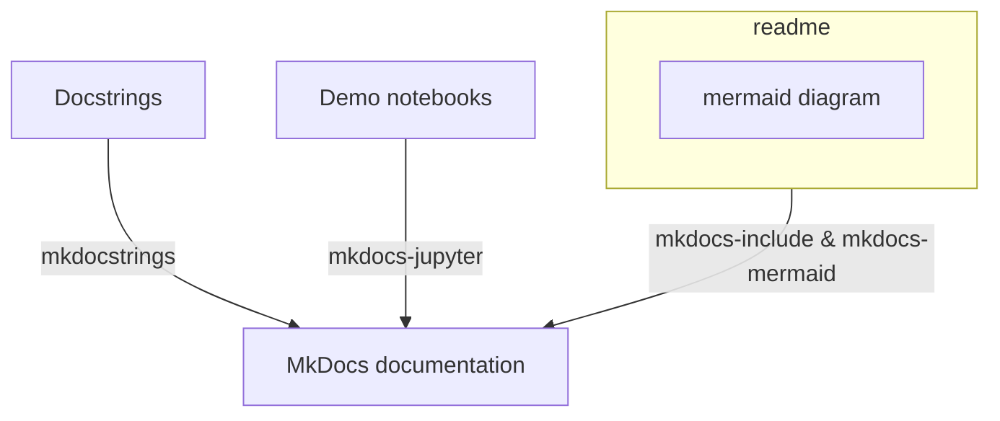

# mkdocs-template
- [mkdocs-template](#mkdocs-template)
  - [Steps to set up MkDocs](#steps-to-set-up-mkdocs)
  - [Documentation structure](#documentation-structure)

<!--intro-start-->

This repo is created to demonstrate how I put together a documentation in MkDocs with several essential components.

## Steps to set up MkDocs
- pip install mkdocs
- Mkdocs new . (to create docs folder for MkDocs)
- pip install mkdocstrings  
- pip install 'mkdocstrings[python]' ??? not sure
- pip install mkdocs-include-markdown-plugin

## Documentation structure

<!--intro-end-->