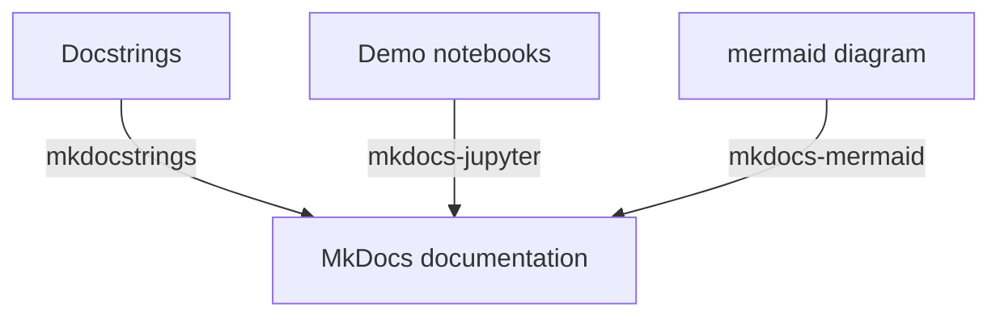

# MkDocs-template
This repo is created to demonstrate how I put together a documentation in MkDocs with several essential components.

## How to use the template

### Components
There are three key components required to write comprehensive documentation including scripts with docstring, demo notebooks and project/system diagrams. Each component requires a specific package so that it can be rendered properly in the documentation.

#### Mkdocstrings
To let MkDocs pick up the docstring you write, you will need MkDocstrings.

#### Mkdocs-jupyter
It is essential to include some demo examples in the documentation, so others can read them without having to spin up a local jupyter session or configure an environment.
#### Mkdocs-mermaid
Sometimes, it is extremely hard to describe something clearly without visuals. It is even more difficult to keep the system diagram also update to date since the codebase might constantly keep changing. Mermaid diagram is a markdown-based diagram generation tool that allows you to generate various kinds of diagrams using markdown language.

### Setup
- pip install -r requirements.txt

### Deploy the doc
