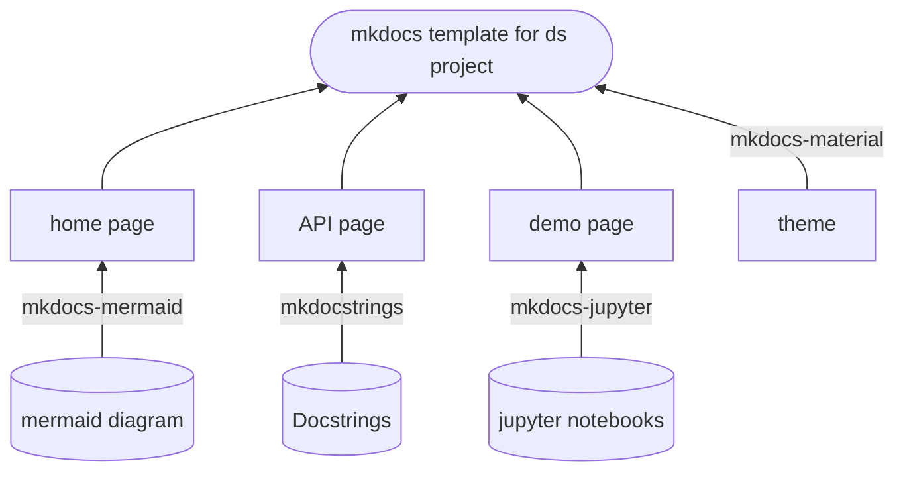

# MkDocs template for data science projects

[Link to the sample documentation page](https://leowu4ever.github.io/MkDocs-template-data-science/)

## Overview
MkDocs is a lightweight static site generator that enables easy creation of documentation websites using markdown files. This repository is created to demonstrate how I put together documentation for data science projects by utilising MkDocs with several essential extensions. Comprehensive documentation should cover the information for different aspects. The proposed template has three pages including the home page, API page and demo page.

The home page serves as a starting point for the project by covering some of the key information, such as the introduction, system diagram and usage guide. It aims to help the audience quickly grasp the overview of the system. The next page is the API page which presents docstrings. It is ideal for those who want to figure out how to exactly use or configure APIs. The last page is the demo page which displays Jupyter notebook demos and it is very beneficial and would be greatly appreciated. To seamlessly integrate these three pages in MkDocs, requires some very specific packages so that all pages can be rendered and presented nicely. In the following section, I will explain what dependencies are needed and how to configure them properly.

## Components
The template requires [Material theme](https://squidfunk.github.io/mkdocs-material/) which not only brings changes in apperances but many customisations in layout and additional features. Additionally, three packages are needed including [mkdocstrings](https://pypi.org/project/mkdocstrings-python/), [mkdocs-jupyter](https://pypi.org/project/mkdocs-jupyter/0.16.1/) and [mkdocs-mermaid](https://pypi.org/project/mkdocs-mermaid2-plugin/). It is quite obvious to tell what job each package does from their names. 

- Mkdocstrings picks up all the docstrings written and format them professionally. It provides great flexibility in controlling how the docstrings are displayed.
- Mkdocs-jupyter helps to render Jupyter notebook but it would have difficulties with certain types of outputs, such as interactive plots created by Plotly. 
- Mkdocs-mermaid enables mermaid diagrams rendering. Mermaid diagram is a markdown-based diagram generation tool that allows you to generate various kinds of diagrams using markdown language. The illustration below is created using Mermaid.

## Usage
### Setup
You need to make sure Python 3.10.8 is installed.
- Install all dependencies.
  - pip install -r requirements.txt.
- Navigate to a desired directory and initialise MkDocs project named 'xxx'.
  - mkdocs new 'xxx'
  - cd 'xxx'
  - You should be able to see a folder named 'docs' and mkdocs.yml file.

### Page configuration
Now the barebone of the template is in place. The below shows how to create and configure the home page, API page and demo page.
- Meta data
  - Some key information is allowed to be changed. See lines 1-5.

- Home page
  - Create a markdown file in the '/docs' folder (can follow **'/docs/index.md'**) and reference it in the nav section in the mkdocs.yml file. See line 9 in the mkdocs.yml file.
  - Write on the markdown file like how you usually would do it in a readme file.
  - The navigation section on the home page can be hidden with the configuration at the top of the index.md file.
  
- API page
  - Make sure Python scripts are documented with docstrings.
  - Create a markdown file in '/docs' folder (can follow **'/docs/car.md'**) and reference it in the nav section in the mkdocs.yml file. See lines 10-13 in the mkdocs.yml file.
  - Each markdown file can associate with at least one module. To include a module, it follows a convention that is very similar to relative importing. For example, the first line in 'car.md' (:::src.car) means including go up two levels and include all docstrings in the car.py module.

- Demo page
  - Create a folder named 'notebooks' in the docs folder. Place Jupyter notebooks in the notebooks folder. Reference it in the nav section in the mkdocs.yml file. See lines 14-15.

### Additional settings
The Material theme provides a lot of flexibility for page layout configurations. It is fine to reuse the settings after line 28. If you would like to make some further changes, you can follow the [Material guide](https://squidfunk.github.io/mkdocs-material/setup/).

### Deployment
GitHub and GitLab can both host static webpages. I will cover how to do deploy the pages on GitHub. 
- Create a GitHub action by including '.github/workflows/ci.yml' in the root directory of your repository. Whenever there is a commit to the main branch, the action is trigged and it builds the pages for you.
- Go to the repository setting, under the 'Pages' tab of the left and 'Build and deployment' section, select 'Deploy from a branch' as the Source and select 'gh-pages' as the 'Branch'. So once the gh-pages branch is updated, it will trigger the deployment pipeline. You can go the action tag and look for the link that is deployed. 

## Final words
The template is created for data scientists/machine learning engineers as a ready-to-use starting point for documentation. It requires only a small amount of adjustments to fit the template for a new project. I wish you find the template useful and welcome any contributions to the project.
