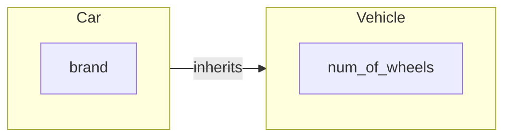

---
hide:
  - navigation
---
# Overview
This is a very simple package containing two modules that implement vehicle and car class. The documentation includes the API docstrings for the modules and a demo example in Jupyter notebook.

## Class structure
