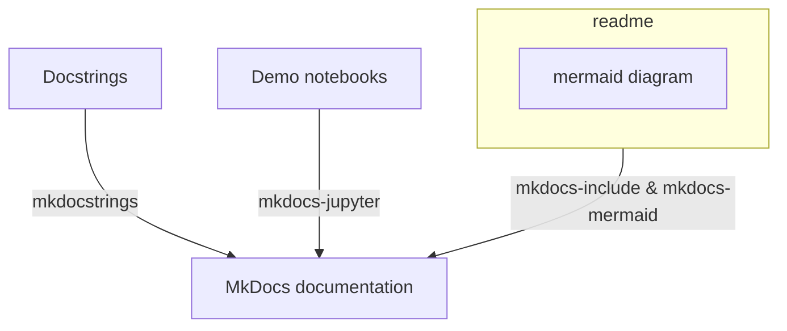

---
hide:
  - navigation
---

# mkdocs-template
This repo is created to demonstrate how I put together a documentation in MkDocs with several essential components.

## Steps to set up MkDocs
pip install -r requirements.txt

## Documentation structure

